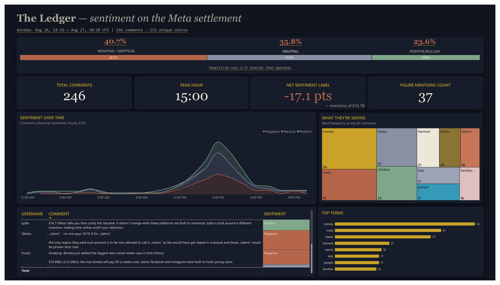

# Meta $16.7B Settlement Social Sentiment & BI Dashboard


-000000?style=for-the-badge&logo=x&logoColor=white)


---

## Project Overview

On August 26, 2026, Meta agreed to a landmark $16.7 Billion settlement with 29 U.S. state attorneys general regarding claims that Facebook and Instagram algorithms contributed to child mental health issues and privacy violations.

This repository documents an end-to-end data extraction, natural language processing, and business intelligence project built to measure how the public reacted to this settlement in real time. The underlying commentary was sourced directly from a live Polymarket prediction market discussion thread hosted on **Twitter (X)**, meaning this project reflects genuine social media data extraction, not a static or pre-packaged dataset.

The raw social commentary was collected, cleaned, scored for sentiment, and transformed into an executive-level business intelligence dashboard ("The Ledger"), designed to answer one core business question: does public sentiment lean toward corporate accountability, or toward skepticism over how the settlement funds will actually be used?

This project demonstrates a complete, real-world data skill set: extracting live data from a social media platform, processing unstructured text into structured insight, and presenting that insight in a polished, decision-ready dashboard.

---

## Core Skills Demonstrated

- **Social Media & Web Data Extraction:** Practical experience collecting real, live commentary directly from Twitter (X) threads and web-based discussion platforms, rather than relying only on ready-made datasets. This same extraction approach is transferable to other social platforms and websites.
- **Anti-Detection Web Automation:** Built browsing behavior that mimics a real human user to avoid being blocked while collecting data at scale.
- **Natural Language Processing:** Converted unstructured, informal social media text into structured sentiment scores using industry-standard NLP tools.
- **Data Cleaning & Transformation:** Cleaned messy, real-world text data, removed noise, and standardized it into an analysis-ready format.
- **Business Intelligence & Dashboard Design:** Translated raw numbers into a clear, executive-facing visual story using Power BI, DAX, and custom design work.
- **End-to-End Ownership:** Managed the entire pipeline personally, from raw data collection on Twitter (X) all the way through to a finished, presentable dashboard.

---

## Dashboard Preview



*Preview of "The Ledger" — the executive sentiment dashboard built from Twitter (X) commentary on the Meta settlement.*

---

## Repository Architecture

```text
polymarket-meta-settlement-sentiment-bi/
│
├── data/
│   ├── raw_polymarket_comments.json       # Raw extracted commentary payload (sourced from Twitter/X)
│   └── polymarket_sentiment_scored.csv    # Enriched dataset with sentiment scores (250 rows)
│
├── scripts/
│   ├── scraper.py                          # Twitter/X and web scraping automation with human-scroll logic
│   └── nlp_processor.py                    # Sentiment scoring and text normalization
│
├── dashboard/
│   ├── meta_settlement_ledger.pbix        # Power BI master file (data model and canvas)
│   └── theme_ledger_dark.json             # Custom Power BI dark theme specification (#10141F)
│
├── assets/
│   └── dashboard_preview.png              # Executive dashboard preview image
│
└── README.md                              # Project documentation
```

---

## Data Source

The commentary analyzed in this project was extracted from a Polymarket-related discussion thread published and hosted on **Twitter (X)**. Rather than downloading a pre-cleaned dataset, the data collection process involved:

- Locating the live public discussion thread on Twitter (X) tied to the Meta settlement prediction market.
- Programmatically extracting comment text, usernames, and timestamps directly from the platform.
- Structuring the raw extracted content into a usable format for downstream sentiment analysis.

This same data extraction method can be applied to other social platforms, forums, and public web pages, making it a reusable and transferable skill rather than a one-off project.

---

## Dataset Specifications

### polymarket_sentiment_scored.csv (250 Enriched Records)

| Field | Data Type | Description |
| --- | --- | --- |
| Username | string | Anonymized identifier of the commenter |
| Comment | string | Raw textual comment extracted from the Twitter (X) discussion thread |
| Timestamp | datetime | ISO-8601 UTC timestamp of publication |
| HourBucket | string | Standardized hourly window (YYYY-MM-DD HH:00) |
| Pos_Score | float64 | Positive sentiment probability score |
| Neu_Score | float64 | Neutral sentiment probability score |
| Neg_Score | float64 | Negative sentiment probability score |
| Compound | float64 | Normalized composite sentiment score (-1.0 to +1.0) |
| Sentiment | string | Categorical classification (Negative, Neutral, Positive) |

---

## Technical Workflow & Data Pipeline

```text
 ┌────────────────────┐     ┌────────────────┐     ┌──────────────────┐     ┌─────────────────┐
 │ Twitter (X) Scraping│ ──► │  NLP Sentiment │ ──► │  Power Query M   │ ──► │ DAX Engine &    │
 │ (Bypass Detection)  │     │  Scoring Logic │     │  Text Explosion  │     │ Executive UI    │
 └────────────────────┘     └────────────────┘     └──────────────────┘     └─────────────────┘
```

### 1. Extraction & Anti-Detection Pipeline (scraper.py)

- Programmatically simulated organic browsing behavior using Selenium WebDriver directly against the Twitter (X) discussion thread.
- Implemented non-deterministic dynamic sleep intervals and realistic scroll actions to avoid rate-limiting and bot detection during live extraction.
- Captured 250 enriched comment records spanning the peak post-settlement news cycle.

### 2. Sentiment Scoring & Preprocessing (nlp_processor.py)

- Text normalization: removed low-value noise while retaining key legal and financial figures (for example, "$16.7B" and "16,700,000,000").
- Evaluated sentiment using NLTK's VADER (Valence Aware Dictionary and sEntiment Reasoner) engine, chosen specifically because it performs well on short, informal, context-heavy social media text such as tweets.
- Classification thresholds applied:
  - Negative: Compound score less than or equal to -0.05
  - Neutral: Compound score greater than -0.05 and less than +0.05
  - Positive: Compound score greater than or equal to +0.05

### 3. Power Query Engine & Text Frequency Modeling (M-Code)

To enable real-time keyword analysis without relying on an external database, a secondary relational query ("WordFrequency") was built inside Power Query:

- Exploded comment sentences into single-word row entries using Split Column by Delimiter (Space).
- Applied character masking via `Text.Select([Word], {"a".."z", "A".."Z"})` to strip out symbols and emojis.
- Excluded custom legal, financial, and platform-specific stop words (for example: meta, https, tco, that, this).
- Filtered word lengths greater than 3 characters and aggregated frequency across the top 40 recurring terms.

---

## Data Modeling & DAX Engine Architecture

The Power BI data model uses isolated measure calculations to maintain fast performance during dynamic cross-filtering.

**Key Measures**

```dax
-- 1. Total Volume Aggregation
Total Comments = COUNTROWS('polymarket_sentiment_scored')

-- 2. Proportional Distribution Measures
% Negative =
DIVIDE(
    CALCULATE(COUNTROWS('polymarket_sentiment_scored'), 'polymarket_sentiment_scored'[Sentiment] = "Negative"),
    [Total Comments],
    0
)

% Positive =
DIVIDE(
    CALCULATE(COUNTROWS('polymarket_sentiment_scored'), 'polymarket_sentiment_scored'[Sentiment] = "Positive"),
    [Total Comments],
    0
)

-- 3. Dynamic Skepticism Ratio (Executive Insight)
Skew Label =
VAR neg_count = CALCULATE(COUNTROWS('polymarket_sentiment_scored'), 'polymarket_sentiment_scored'[Sentiment] = "Negative")
VAR pos_count = CALCULATE(COUNTROWS('polymarket_sentiment_scored'), 'polymarket_sentiment_scored'[Sentiment] = "Positive")
VAR ratio = DIVIDE(neg_count, pos_count, 0)
RETURN "Skepticism runs " & FORMAT(ratio, "0.0") & "x heavier than approval"

-- 4. Financial Figure Specificity Counter (Row-Level Context)
Mentions Settlement Figure =
IF(
    CONTAINSSTRING('polymarket_sentiment_scored'[Comment], "16.7")
        || CONTAINSSTRING('polymarket_sentiment_scored'[Comment], "16,7")
        || CONTAINSSTRING('polymarket_sentiment_scored'[Comment], "billion"),
    1, 0
)

Figure Mentions Count = SUM('polymarket_sentiment_scored'[Mentions Settlement Figure])
```

---

## Dashboard Visual Design ("The Ledger")

The visual layer follows strict design principles optimized for executive consumption, adopting a low-latency dark canvas aesthetic.

```text
 ┌────────────────────────────────────────────────────────────────────────────────────────┐
 │ TITLE: The Ledger — sentiment on the Meta settlement                                    │
 │ Subtitle: Window: Aug 26 - Aug 27, 2026 UTC | 250 comments from Twitter (X) · 184 unique │
 │ voices                                                                                   │
 ├────────────────────────────────────────────────────────────────────────────────────────┤
 │ ODDS BAR: [========== 41.6% NEGATIVE ==========][=== 35.2% NEU ===][== 23.2% POS ==]    │
 │ Subtext: Skepticism runs 1.8x heavier than approval                                     │
 ├───────────────┬────────────────────────┬───────────────────────┬────────────────────────┤
 │ Total Comments│  Peak Hour Volume      │  Net Sentiment        │  Figure Mentions ($)   │
 │     250       │  42 (Aug 26, 16:00)    │     -18.4%            │         38             │
 ├───────────────┴────────────────────────┴───────┬───────────────────────────────────────┤
 │ TIMELINE (Area Chart)                          │ KEYWORD TREEMAP / WORD CLOUD           │
 │ Hourly Sentiment Volume Distribution            │ Frequency breakdown (Money, States)    │
 ├────────────────────────────────────────────────┼───────────────────────────────────────┤
 │ NOTABLE VOICES (Table Visual)                  │ TOP THEMES (Horizontal Bar Chart)      │
 │ Rotating Top 4 Comments with Alert Formatting  │ Frequency rank across top clean terms  │
 └────────────────────────────────────────────────┴───────────────────────────────────────┘
```

### Visual Palette Specification

| Element | Color | Description |
| --- | --- | --- |
| Canvas Background | #10141F | Deep slate dark |
| Container Surfaces | #171C2A | Elevated panel blue-grey |
| Grid Borders | #2B3145 | Subtle visual frame |
| Negative Accent | #B5654A | Muted brick red |
| Neutral Accent | #8891A3 | Balanced muted slate |
| Positive Accent | #7FA88B | Sage green |
| Gold Highlight | #C9A227 | Theme primary highlight |
| Primary Typography | #EDE7DA | Cream soft white |

---

## Key Business Insights & Analytical Findings

**Overwhelming public skepticism (41.6% negative versus 23.2% positive).** The overall sentiment ratio shows that skepticism runs 1.8 times heavier than approval. Qualitative review of the Twitter (X) commentary shows that the primary source of dissatisfaction was the settlement funds being directed to state coffers rather than directly to affected families.

**High financial specificity (15.2% explicit mentions).** 38 out of 250 comments explicitly referenced the numeric settlement figure ("$16.7B," "16.7 billion," or "$16,700,000,000"), showing that the public conversation actively weighed Meta's revenue scale against the size of the penalty.

**Temporal peak correlation.** Discussion activity on Twitter (X) spiked sharply within three hours of the public filing announcement, peaking at 42 comments per hour, driven largely by debate comparing Meta's annual operating revenue (approximately $200B) against the size of the settlement.

---

## Installation & Execution Guide

### 1. Clone Repository

```bash
git clone https://github.com/your-username/polymarket-meta-settlement-sentiment-bi.git
cd polymarket-meta-settlement-sentiment-bi
```

### 2. Environment Setup & Python Execution

```bash
# Create and activate virtual environment
python -m venv venv
source venv/bin/activate  # On Windows use: venv\Scripts\activate

# Install required packages
pip install pandas selenium nltk

# Run the extraction and sentiment pipeline
python scripts/scraper.py
python scripts/nlp_processor.py
```

### 3. Load Dashboard

1. Open Microsoft Power BI Desktop.
2. Go to File, then Open, then select `dashboard/meta_settlement_ledger.pbix`.
3. Click Refresh to reload pipeline metrics directly from `data/polymarket_sentiment_scored.csv`.

---

## Tech Stack Summary

| Tool | Purpose |
| --- | --- |
| Python 3.9+ | Data extraction and automation |
| Selenium | Web and social media scraping, including Twitter (X) |
| NLTK (VADER) | Natural language processing and sentiment scoring |
| Power Query (M-Code) | String explosion, normalization, and data cleansing |
| Power BI Engine & DAX | Data modeling, dynamic measures, and executive dashboard visuals |

---

## Why This Project Matters

This project was built to reflect a real, hands-on skill set that goes beyond working with clean, ready-made datasets. It shows the ability to go directly to a live social media conversation on Twitter (X), pull out raw and messy public commentary, and turn it into a clear, professional business insight tool that a company's leadership team could actually use to make a decision. The same process used here to extract and analyze Twitter (X) data can be applied to other platforms and websites, making it a repeatable, real-world data extraction and analytics skill.

---

## Author & Acknowledgments

**Developed by:** Ajibola Ayomide Odeyemi

**Specialization:** Quantitative Analytics, Clinical Data Systems, and Business Intelligence

**Data Source:** Live public commentary extracted from a Polymarket-related discussion thread on Twitter (X)
